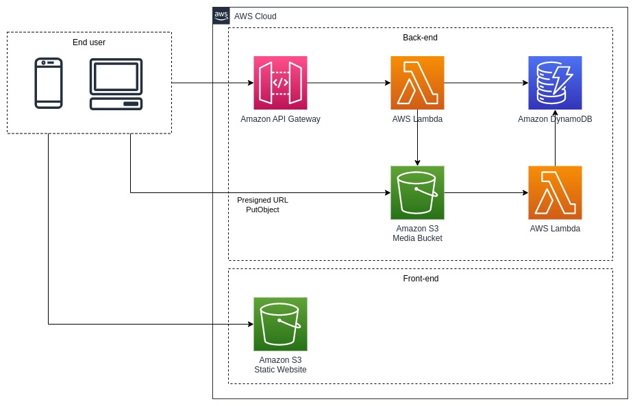

# AWS and Serverless

This repository contains the code and resources used in the "AWS and Serverless" webinar, where we migrated a traditional Express server application to serverless using AWS Lambda and other serverless technologies.

## API

The `/api` folder contains the code and resources for the User API that was migrated from a server to a serverless architecture. This API is built using Node.js and is designed to be deployed using AWS Lambda.

## Public

The `/public` folder contains the code and resources for the static website that is hosted using AWS S3. This website is designed to work with the User API.

## Tools

### Stacks

The `/tools/stacks` folder contains the CloudFormation templates used to create the necessary resources in AWS, including a DynamoDB table and S3 buckets for media and website hosting.

### Function

The `/tools/functions` folder contains the code for the Lambda function that listens to the media S3 bucket and updates the user's DynamoDB record when a new image is uploaded.

### Collection

The `/tools/collections` folder contains a Postman collection that can be used to interact with the User API.

## Getting Started

To get started with this repository, you'll need to have an AWS account and the AWS CLI installed on your local machine. You can use the CloudFormation templates in the `/tools/stacks` folder to create the necessary resources in AWS.

Once you have the resources created, you can deploy the User API and Media Bucket Listener using the Serverless Framework. The Serverless Framework configuration files are included in the `/api` and `/tools/functions` folders.

For more information on how to deploy the application, please refer to the README files in each folder.

## Final Solution

Below is a visual representation of the final solution. The backend has been migrated to serverless using Lambda and the Serverless Framework, while the frontend is hosted on an S3 bucket for static websites. The application leverages the power of AWS services such as DynamoDB and S3, and uses S3 events to trigger a Lambda function whenever a new image is uploaded to the S3 bucket.

## License

This repository is licensed under the MIT License. See the LICENSE file for more information.
